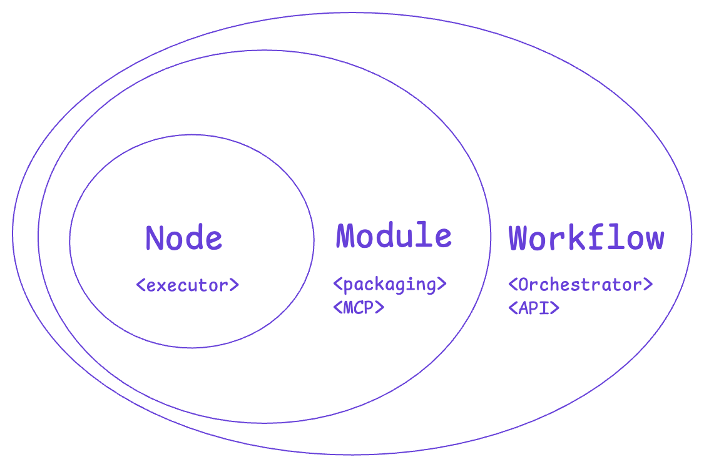
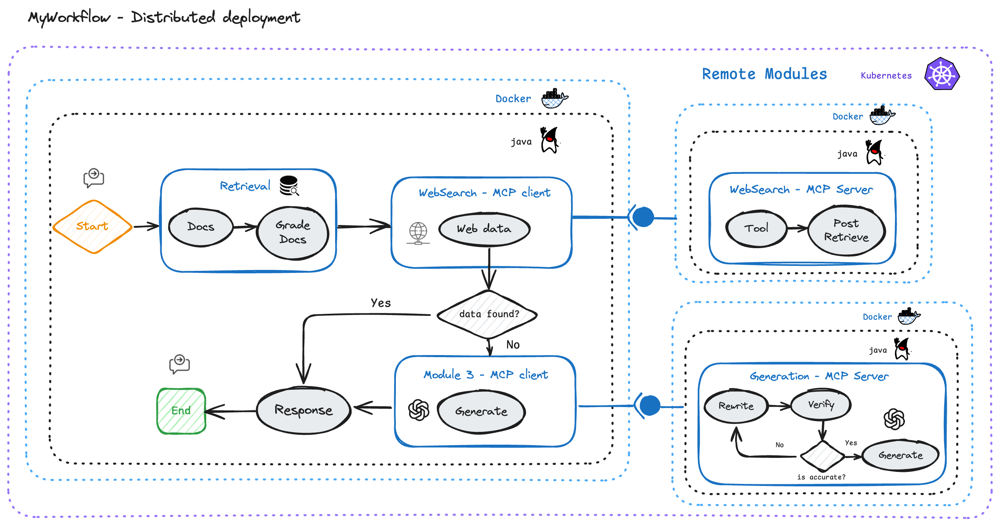
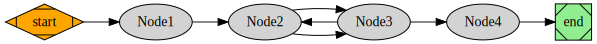

# JavAI Workflow 🦜🔀: Build programmatically custom agentic workflows, AI Agents, RAG systems for java
[](https://github.com/czelabueno/langchain4j-workflow/actions/workflows/ci.yaml)
[](https://maven-badges.herokuapp.com/maven-central/dev.langchain4j/langchain4j-workflow)
[](https://opensource.org/licenses/Apache-2.0)

An open-source Java library to build, package, integrate, orchestrate and monitor agentic AI systems for java developers 💡



> 🌟 **Starring me**: If you find this repository beneficial, don't forget to give it a star! 🌟 It's a simple way to show your appreciation and help this project grow!

## Overview
JavAI Workflow (named initially Langchain4j-workflow) is a dynamic, stateful workflow engine crafted as a Java library. It empowers java developers with granular control over the orchestrated workflows as a graph, iteratively, with cycles, flexibility, control, and conditional decisions. This engine is a game-changer for building sophisticated AI applications, such as multiples RAG-based approaches using modern paradigms and agent architectures. It enables the crafting of custom behavior, leading to a significant reduction in hallucinations and an increase in response reliability.

jAI Workflow is influenced by [LangFlow](https://github.com/langflow-ai/langflow), [LangGraph](https://langchain-ai.github.io/langgraph/tutorials/introduction/), [Graphviz](https://graphviz.gitlab.io/Gallery/directed/).

## Principles:
- **Java-based** jAI workflows are configuration as code (java) and agnostic to AI models, enabling you can define custom advanced and dynamic workflows just writing Java code.
- **Stateful**: jAI Workflow is a stateful engine, enabling you to design custom states as POJO and transitions. This feature provides a robust foundation for managing the flow and state of your application.
- **Graph-Based**: The workflow is graph-based, offering the flexibility to define custom workflows with multiple directions such as one-way, round trip, loop, recursive and more. This feature allows for intricate control over the flow of your application.
- **Flexible**: jAI Workflow is designed with flexibility in mind. You can define custom workflows, modules or agents to build RAG systems as LEGO-like. A module can be decoupled and integrated in any other workflow.
- **Ecosystem integration**: jAI workflow will be integrated with any java AI project. It provides a comprehensive toolset for building advanced java AI applications.
- **Publish as API**: jAI Workflow can be published as an API as entrypoint once you have defined your custom workflow. This feature allows you to expose your workflow as a service.
- **Observability**: jAI Workflow provides observability features to monitor the execution of the workflow, trace inputs and outputs, and debug the flow of your application.
- **Scalable**: jAI Workflow can be deployed as any java project as standalone or distributed mode as containers in any cloud provider or kubernetes environment. Each module can run in a different JVM env or container for scalability in production environments.

## 🚀 Features
### v.0.2.0 Features
- **Graph-core**: The engine supports create `Nodes`, `Conditional Nodes`, `Edges`, and workflows as a graph. This feature allows you to define custom workflows with multiple `Transitions` between nodes such as one-way, round trip and recursive. 
- **Run workflow**: jAI Workflow supports synchronized `workflow.run()` and streaming `worflow.runStream()` runs the outputs as they are produced by each node. This last feature allows for real-time processing and response in your application.
- **Integration**: [LangChain4j](https://docs.langchain4j.dev/) integration, enabling you to define custom workflows using all the features that LangChain4j offers. This integration provides a comprehensive toolset for building advanced AI applications to integrate with multiple LLM providers and models.
- **Visualization**: The engine supports the generation of workflow images. This feature allows you to visualize the flow computed of your app workflow. By Default it uses `Graphhviz` lib to generate the image, but you implement your own image generator on `GraphImageGenerator.java` interface.
### Q1 2025 Features
- **Graph-Core**:
  - Split Nodes
  - Merge Nodes
  - Parallel transitions
  - Human-in-the-loop
- **Modular (Group of nodes)**:
  - Module
  - Remote Module
- **Integration**:
  - Model Context Protocol (MCP) integration as server and client.
  - Define remote module as MCP server.
- **Observability**:
  - OpenTelemetry integration (metrics and traces).
  - Debugging mode logging structure.
### 🗺️ Future Features
- **Deployment Model**:
  - Dockerize workflow
  - Kubernetes deployment
  - Cloud deployment
- **API**:
  - Publish workflow as API (SSE for streaming runs and REST for sync runs).
- **Playground**:
  - Web-based playground to add, test and run jAI workflows APIs.
  - Chatbot Q&A viewer.
  - Graph tracing visualization for debugging

## Architecture
jAI Workflow is designed with a modular architecture, enabling you to define custom workflows, modules, or agents to build RAG systems as LEGO-like. A module can be decoupled and integrated into any other workflow.

### Standalone Architecture


### Distributed Architecture


> 📖 Full documentation will be available soon

## 💡How to use in your Java project
In **jAI Workflow**, the notion of state plays a pivotal role. Every execution of the graph initiates a state, which is then transferred among the nodes during their execution. Each node, after its execution, updates this internal state with its own return value. The method by which the graph updates its internal state is determined by user-defined functions.

The simplest way to use jAI Workflow in your project is with the [LangChain4j](https://docs.langchain4j.dev) integration because enables you to define custom workflows using all the features that LangChain4j offers. This integration could provide a comprehensive toolset for building advanced AI applications:
```xml
<dependency>
  <groupId>com.github.czelabueno</groupId>
  <artifactId>langchain4j-workflow</artifactId>
  <version>0.2.0</version> <!--Change to the latest version-->
</dependency>
```

If you would want to use jAI workflow without LangChain4j or with other framework, add the following dependency to your `pom.xml` file:
```xml
<dependency>
  <groupId>com.github.czelabueno</groupId>
  <artifactId>jai-workflow-core</artifactId>
  <version>0.2.0</version> <!--Change to the latest version-->
</dependency>
```
### Example
Define a stateful bean with fields that will be used to store the state of the workflow:
```java
// Define a stateful bean
public class MyStatefulBean {
  int value = 0;
}
```

Create a simple workflow with 4 nodes and conditional edges:
```java
public class Example {
  public static void main(String[] args) {
    
    MyStatefulBean myStatefulBean = new MyStatefulBean();

    // Define functions that determines statefulBean state
    Function<MyStatefulBean, String> node1Func = obj -> {
      obj.value +=1;
      System.out.println("Node 1: [" + obj.value + "]");
      return "Node1: function proceed";
    };
    Function<MyStatefulBean, String> node2Func = obj -> {
      obj.value +=2;
      System.out.println("Node 2: [" + obj.value + "]");
      return "Node2: function proceed";
    };
    Function<MyStatefulBean, String> node3Func = obj -> {
      obj.value +=3;
      System.out.println("Node 3: [" + obj.value + "]");
      return "Node3: function proceed";
    };
    Function<MyStatefulBean, String> node4Func = obj -> {
      obj.value +=4;
      System.out.println("Node 4: [" + obj.value + "]");
      return "Node4: function proceed";
    };

    // Create the nodes and associate them with the functions to be used during execution.
    Node<MyStatefulBean, String> node1 = Node.from("node1", node1Func);
    Node<MyStatefulBean, String> node2 = Node.from("node2", node2Func);
    Node<MyStatefulBean, String> node3 = Node.from("node3", node3Func);
    Node<MyStatefulBean, String> node4 = Node.from("node4", node4Func);


    // Create workflow
    StateWorkflow<MyStatefulBean> workflow = DefaultStateWorkflow.<MyStatefulBean>builder() 
            .statefulBean(myStatefulBean)
            .addNodes(Arrays.asList(node1, node2, node3))
            .build();

    // You can add more nodes after workflow build. E.g. node4
    workflow.addNode(node4);

    // Define edges
    workflow.putEdge(node1, node2);
    workflow.putEdge(node2, node3);
    // Conditional edge
    workflow.putEdge(node3, Conditional.eval(obj -> {
      System.out.println("Stateful Value [" + obj.value + "]");
      if (obj.value > 6) {
        return node4;
      } else {
        return node2;
      }
    }));
    workflow.putEdge(node4, WorkflowStateName.END);

    // Define which node to start
    workflow.startNode(node1);

    // Run workflow normally
    workflow.run();
    // OR
    // Run workflow in streaming mode
    workflow.runStream(node -> {
      System.out.println("Processing node: " + node.getName());
    });

    // Print all computed transitions
    String transitions = workflow.prettyTransitions();
    System.out.println("Transitions: \n");
    System.out.println(transitions);

    // Generate workflow image
    workflow.generateWorkflowImage("image/my-workflow.svg");
    // workflow.generateWorkflowImage(); // if you use this method, it'll use by default the root path and default image name.
  }
}
```
Now you can check the output of the workflow execution.

```shell
STARTING workflow in stream mode..
Processing node: node1
Node 1: [1]
Processing node: node2
Node 2: [3]
Processing node: node3
Node 3: [6]
Stateful Value [6]
Processing node: node2
Node 2: [8]
Processing node: node3
Node 3: [11]
Stateful Value [11]
Processing node: node4
Node 4: [15]
Reached END state
```
You can print all computed transitions:

```shell
START -> node1 -> node2 -> node3 -> node2 -> node3 -> node4 -> END
```
You can generate a workflow image with all computed transitions:
```shell
> image/
> ├── my-workflow.svg
```


## LLM examples
You can check all examples in the [langchain4j-worflow-examples](https://github.com/czelabueno/langchain4j-workflow-examples) repository where show you how-to implement multiple RAG patterns, agent architectures and AI papers using LangChain4j and jAI Workflow. 

> Please note that examples can be modified and more examples will be added over time.

### MoA
- **Mixture-of-Agents (MoA)**:
  - Java example: [`langchain4j-moa`](https://github.com/czelabueno/langchain4j-workflow-examples/tree/main/langchain4j-moa)
  - Based on Paper: https://arxiv.org/pdf/2406.04692

### RAG
- **Corrective RAG (CRAG)**:
  - Java example: [`langchain4j-corrective-rag`](https://github.com/czelabueno/langchain4j-workflow-examples/tree/main/langchain4j-corrective-rag)
  - Based on Paper: https://arxiv.org/pdf/2401.15884
- **Adaptive RAG**:
  - Java example: _Very soon_
  - Based on Paper: https://arxiv.org/pdf/2403.14403
- **Self RAG**:
  - Java example: _Very soon_
  - Based on Paper: https://arxiv.org/pdf/2310.11511
- **Modular RAG**:
  - Java example: _Very soon_
  - Based on Paper: https://arxiv.org/pdf/2312.10997v1

### Agent Architectures
- **Multi-agent Collaboration**:
  - Java example: _Very soon_
  - Based on Paper: https://arxiv.org/pdf/2308.08155
- **Agent Supervisor**:
  - Java example: _Very soon_
  - Based on Paper: https://arxiv.org/pdf/2308.08155
- **Planning Agents**:
  - Java example: _Very soon_
  - Based on Paper: https://arxiv.org/pdf/2305.04091

## 💬 Contribute & feedback
If you have any feedback, suggestions, or want to contribute, please feel free to open an issue or a pull request. We are open to new ideas and suggestions.
Help us to maturity this project and make it more useful for the java community.

## 🧑🏻‍💻 Authors
- Carlos Zela [@c_zela](https://x.com/c_zela) [czelabueno](https://linkedin.com/in/czelabueno)
